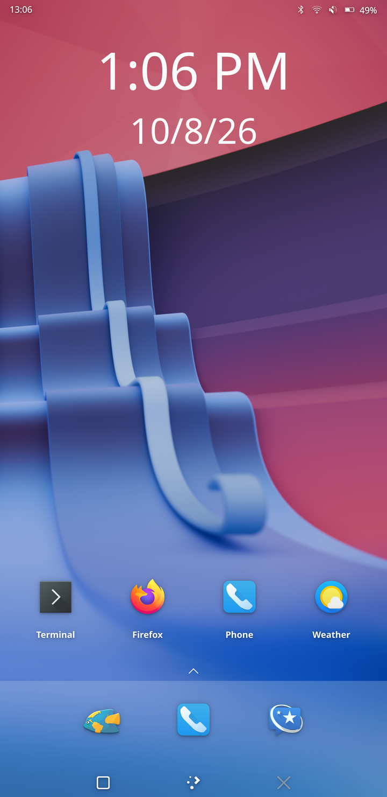
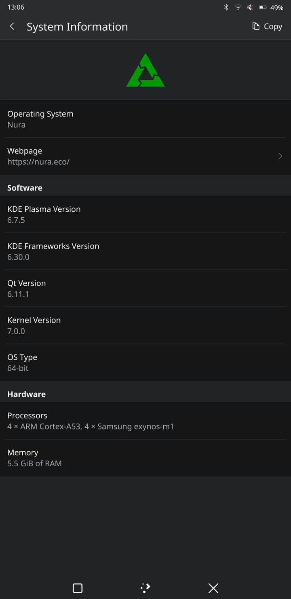

# postmarketOS on the Samsung Galaxy Note 8 (greatlte / SM-N950F)

<p align="center">
  
  &nbsp;&nbsp;
  
</p>

Mainline Linux (7.0) running on the Exynos 8895 Samsung Galaxy Note 8,
with a fully open-source boot chain, a **native display driver** (DECON + DSI +
DSC for the S6E3HA6 AMOLED panel), a GPU-composited desktop on the Mali-G71
(panfrost, 546 MHz), CPU frequency scaling up to the stock 2.3 GHz with real
voltage control and thermal throttling, the
**internal UFS storage** (rootfs on `userdata`, no microSD needed), WiFi,
Bluetooth PAN networking, and KDE Plasma Mobile with a working touchscreen
and web browsers (Firefox, Angelfish).

This repository contains everything needed to build and install it:
device kernel packages (with all our mainline driver work as patch files),
the uniLoader board files, and the phone-side runtime addons.

> Status: **daily-driver-ish for tinkering**. See "What works / What doesn't"
> below — the boot console, the microphones and calls are the main known
> limitations.
>
> **New user?** Grab the prebuilt boot image and microSD image from the
> [Releases](https://github.com/athulkrishnan97/postmarketos-note8/releases)
> page and follow "Quick start" below — no build needed.

---

## What works

| Feature | Details |
|---|---|
| Boot | Samsung bootloader → uniLoader → mainline kernel → postmarketOS rootfs from **internal UFS** (or microSD) |
| Display | Native KMS: **DECON_f → dual DSC encoders → DSI (4 lanes) → S6E3HA6** AMOLED, 1440×2960, command mode with real vblank (59 Hz panel refresh), zero-copy GPU scan-out (PRIME) |
| CPU frequency scaling | Stock maxima: 741 MHz – **2.314 GHz** (big Mongoose) / 455 MHz – 1.69 GHz (little A53), `schedutil`, with **voltage scaling** via the S2MPS17 PMIC over a ported SPEEDY bus driver. Cluster clocks/rails match the phone's ECT tables. CPU voltages are the stock ones for the developer's chip (ASV fuses at 0x10009000: table 8, big group 6, little group 7) **plus 25 mV** — the bare table froze the phone in normal use. Each Exynos 8895 is fused into its own bin, so a different chip may need more: if yours freezes under load, raise `opp-microvolt` in `exynos8895-cpu-stock-volts.patch` (or drop that patch for the old, conservative worst-bin voltages). The dts gives the scheduler the cores' relative speed (`capacity-dmips-mhz`, M2 ≈ 2.45× an A53), so busy threads run on the big cores. |
| RAM | All **6 GB** banks (5.6 GB usable: ~230 MB is reserved for firmware carveouts). The 4th bank at `0x900000000` is normally filled in by Samsung's bootloader; our dts lists it. |
| Thermal | Exynos 8895 **TMU** (mainline `exynos_tmu` + an 8895 variant): CPU throttling from **95 °C**, with further steps at 100 and 110 °C (stock Samsung starts at 83 °C), critical shutdown at 115 °C. With the stock voltages a 20 s all-core run at 2.3 GHz reaches ~69 °C. Without it the SoC ran away past 150 °C and reset. |
| GPU | Mali-G71 MP20 via mainline **panfrost** at **546 MHz** (stock max, ECT voltage + margin), Mesa kmsro pairs it with the display; kmscube 60 fps |
| Brightness | Real panel brightness through a backlight device in the panel driver: it sets the AMOLED off ratio (AOR, 0xB1) on top of the bootloader's gamma, so 100 % is the bootloader's level and the slider dims from there. KWin uses it instead of recolouring every frame on the GPU. |
| Touchscreen | Samsung s6sy761 (Y661), multi-touch, works in console **and** Plasma Mobile |
| WiFi | Broadcom **BCM4361**B0 (PCIe, brcmfmac) — auto-connects at boot. Use 2.4 GHz WPA2. |
| Bluetooth | BCM4347B0 UART, works (incl. a BT-PAN IP link to a laptop) |
| GUI | KDE Plasma Mobile (tinydm autologin), GPU-composited, **60 fps** (vblank/flip events at DECON frame start); output scale 3 |
| Web browsers | Firefox and Angelfish (the start-up hard freeze was Linux using firmware-owned RAM — fixed by reserving the stock carveouts, see docs/BRINGUP.md §17) |
| USB | **Device mode, USB 2.0 high speed**: DWC3 + an 8895 variant of the mainline Exynos USB PHY driver. postmarketOS's USB network (CDC NCM) works, so `ssh user@172.16.42.1` over the cable (~30 MB/s). A small MAX77865 MUIC driver routes D+/D- to the SoC, so it also works with the cable attached at boot. |
| SSH | over WiFi, USB (172.16.42.1) or the Bluetooth PAN link |
| MTP | `usb-mode mtp` switches the USB gadget to MTP (`umtprd` via postmarketOS's usb-signaller): the phone's `/home` appears as "Home" in Dolphin/Files, ~14 MB/s each way. `usb-mode developer` switches back to USB networking (SSH); only one mode at a time. |
| Battery level | MAX77865 fuel gauge via the mainline `max17042_battery` driver (new `maxim,max77865-battery` compatible): percentage, voltage, current, capacity and cycle count in Plasma/UPower. The gauge's own temperature is a fixed 25 °C; the real battery, charger and USB-connector temperatures come from the NTC thermistors on the SoC ADC (`battery-thermal`, `charger-thermal`, `usb-thermal` thermal zones, stock lookup table). |
| Charging | **USB PD fast charging** (9 V, 15 W like stock: ~2.4 A into the battery) plus per-source limits for everything else. The `greatlte-charging` service reads the S2MM005 USB-C/PD controller and the MUIC's BC1.2 detection about once a second: PD chargers get the highest offer up to 9 V; Type-C 3 A / 1.5 A sources and BC1.2 chargers (1.8 A in) get what they advertise; plain USB ports stay at 500 mA; unplugging resets to 500 mA. Charge current is cut on battery temperature like stock (41 °C → 1.15 A, 50 °C → stop, cold limits). Type **`charger`** in a terminal for a live view (source, negotiated voltage, the charger's offers, battery voltage/current/watts and temperatures). A small MAX77865 charger driver services the charge watchdog the bootloader leaves on (otherwise charging stops ~3 min after boot). Samsung AFC (9 V over D+/D−) is not supported. |
| Audio | **Bottom loudspeaker** (default output) and **earpiece** (top receiver) for media and system sound through PulseAudio/Plasma, volume keys included. The speaker is a MAX98506 amplifier (new mainline driver) on ABOX UAIF4, whose pins are `gph3-0..3`; it plays at 48 kHz at the stock +13 dB gain, and PulseAudio does its volume in software (the amp mutes briefly on every gain change). A new mainline **ABOX** driver boots Samsung's Calliope firmware on the audio subsystem's Cortex-A7 and streams over UAIF0 to the **CS47L93** codec (madera driver, I2S provider, FLL from the 26 MHz PMU clock output). Capture path works (loopback-verified). ALSA UCM profile in `rootfs-addons/`; earpiece volume capped at −6 dB where it starts to distort. Headphone jack routed but untested (no jack detection yet). |
| Screen off | The power button turns the panel off (display off + sleep in) and back on. Tap-to-wake is KWin's `DoubleTapWakeup` (`~/.config/kwinrc`, `[Wayland]`); set it to `false` to wake only with the power button. |
| Memory / swap | 5.5 GB usable RAM; zram swap (lzo-rle, 150 % of RAM, priority 300) backed by a 10 GB swap file (priority 100). The kernel has only the LZO zram backend, so deviceinfo sets the algorithm (the zstd default left zram off). On a small microSD, lower `swap_size` in `/etc/conf.d/swapfile`. |
| Internal storage | Toshiba THGAF4G9N4LBAIRA 64 GB **UFS 2.1**, mainline `ufs-exynos` with an 8895 variant: **HS-G3 rate B ×2 lanes, ~600 MB/s**. Root on `USERDATA` (sda21, 52.7 GB), `/boot` on `CACHE` (sda16). All 21 GPT partitions + boot/RPMB LUNs visible. |
| microSD | Optional now; works at UHS SDR50 (heavy reads can still error, see below) |

## What doesn't (yet)

| Feature | Why | Path forward |
|---|---|---|
| microSD under heavy reads | No `vqmmc` (S2MPS17 LDO2) yet, so UHS signalling is never switched to 1.8 V: sustained reads can hit command timeouts / I/O errors. Irrelevant when booting from UFS. | Add LDO2 + downstream per-mode sample timings. |
| Boot console on the panel | Enabling fbdev emulation (fbcon) crashes early boot; the screen stays black until Plasma starts. | Debug the fbdev path against the DECON driver. |
| 5 GHz / WPA3 WiFi | 5 GHz WPA2 associates, but booting while joined to a 5 GHz network froze the phone ~35–55 s in, when the CPU boost and the desktop/GPU start-up coincided (2.4 GHz boots never did). `cpuspeed.start` now waits until 90 s after boot, which avoids it. The WPA3 SSID still won't associate. | Find the actual cause (brcmfmac at 5 GHz vs. a supply droop under load). |
| Sustained full-speed WiFi RX | >5–10 min of heavy download instantly reboots the phone (no panic log). Suspect brcmfmac. | Trickled transfers work around it; needs a proper bug hunt. |
| USB host mode / USB 3 | Peripheral only, high speed. Host mode (OTG) needs Type-C role detection (S2MM005) and VBUS output; USB 3 needs the PIPE3 side of the PHY. | S2MM005 / role switch; PIPE3 init from the vendor CAL. |
| Microphones, jack detection, speaker protection | The mics need MICBIAS routing; no jack/button detection. The speaker runs without Samsung's DSM speaker protection (it ran on the ABOX DSP), so its gain is held at the stock level. Calls need the modem. | UCM capture devices; madera jack detection. |
| S Pen (wacom w90xx) / hw keys | No mainline driver. | Port the downstream wacom_i2c-style driver. |

## Repository layout

```
aports/                 postmarketOS device packages (build these with pmbootstrap)
  linux-postmarketos-exynos8895/   the kernel: all driver work as patch files
                                   greatlte-dts.patch, exynos8895-pcie-wifi.patch
                                   (PCIe/brcmfmac, cpufreq+PMIC, GPU, touch),
                                   exynos8895-display.patch (DECON/DSI/panel,
                                   GPU clock, CPU cluster fix, touch fix),
                                   exynos8895-ufs.patch (internal UFS storage),
                                   greatlte-reserved-memory.patch (firmware RAM
                                   carveouts; the browser-freeze fix),
                                   greatlte-grow-rootfs.patch (grow the
                                   microSD rootfs on first boot),
                                   greatlte-no-fw-fallback.patch (WiFi up in
                                   ~6 s instead of ~2 min),
                                   exynos8895-decon-frame-start.patch (60 fps:
                                   vblank/flip at frame start),
                                   exynos8895-thermal.patch (TMU + thermal zones),
                                   exynos8895-cpu-2314.patch (big cluster to 2.3 GHz),
                                   greatlte-6gb-ram.patch (4th DRAM bank),
                                   exynos8895-usb.patch (USB device mode: PHY,
                                   DWC3 glue, MAX77865 MUIC path, dts),
                                   greatlte-battery.patch (MAX77865 fuel gauge
                                   and charger watchdog driver),
                                   greatlte-panel-off.patch (panel off on DPMS),
                                   exynos8895-audio.patch (ABOX audio driver +
                                   Calliope firmware boot, CS47L93 codec supplies,
                                   PMU clock output, sound card, dts),
                                   exynos8895-audio-vss.patch (map the firmware's
                                   VSS window: no SysMMU fault storm at boot),
                                   exynos8895-cpu-capacity.patch (big/little
                                   capacity for the scheduler),
                                   greatlte-panel-backlight.patch (AOR brightness),
                                   exynos8895-speaker.patch (MAX98506 driver, ABOX
                                   UAIF4 speaker path, DMA position fix, dts),
                                   exynos8895-cpu-stock-volts.patch (stock CPU
                                   voltages + 25 mV, throttling from 95 °C),
                                   exynos8895-charging.patch (SoC ADC + battery/
                                   charger/USB NTC thermal zones, S2MM005 bus)
  device-samsung-greatlte/         device package (device info, zram/swap settings)
  uniloader-samsung-greatlte/      bootloader package
uniloader-files/        our uniLoader board port (2 files; applied onto upstream uniLoader)
rootfs-addons/          files to install into the phone rootfs
  etc-init.d/g3d                    brings panfrost up before the display manager
  etc-init.d/hciattach              Bluetooth UART attach (BCM4361, 3 Mbaud)
  etc-init.d/greatlte-charging      charging policy service (runs usr-libexec/greatlte-charging)
  usr-libexec/greatlte-charging     USB PD 9 V request, per-source current limits, temperature cutback
  etc-umtprd/umtprd.conf            MTP: /home as "Home", files owned by uid 10000
  usr-local-bin/charger             live charger/battery view (`charger`, `charger -1`)
  usr-local-bin/usb-mode            switch USB mode (developer / mtp / tethering / charging)
  etc-xdg-plasma-workspace-env/     Qt glyph cache workaround (testing, see BRINGUP 23)
  etc-NetworkManager-dispatcher.d/60-appstream  fetch Discover's catalogues (Alpine + Flathub) once online
  etc-udev-rules.d/                 starts/stops hciattach on rfkill
  etc-NetworkManager-dispatcher.d/  resyncs the clock once WiFi is up (no RTC)
  etc-local.d/cpuspeed.start        switches both clusters to schedutil 90 s after boot
  usr-local-bin/bt-pan-up.sh        one-command BT-PAN network to a laptop
  firmware/                         BCM4361 wifi firmware + board NVRAM + BT .hcd,
                                    ABOX Calliope audio firmware (calliope_*.bin)
  usr-share-alsa-ucm2/              ALSA UCM profile (speaker / earpiece / headphones)
  etc-pulse-default.pa.d/           PulseAudio: default to the bottom speaker at every start
tools/                  install-rootfs-addons.sh (put rootfs-addons into a pmbootstrap image),
                        soak.sh (hash-checked per-CPU load test for clocks/thermals),
                        ect_parse.py (dump the bootloader's ECT voltage/PLL tables),
                        regdump.c (/dev/mem register ranges), reboot-download.c
docs/BRINGUP.md         the full technical journey: every root cause we hit
                        (section 15: display, GPU clock, CPU clusters)
docs/HANDOVER.md        running handover notes between agents (state, lessons, open items)
```

## Quick start (prebuilt release)

The release has two files plus checksums:

- `boot-greatlte-7.0.img`: uniLoader + kernel 7.0 + dtb, for the `BOOT` partition.
- `pmos-greatlte-plasma-mobile.img.xz`: microSD image (postmarketOS edge,
  Plasma Mobile, Firefox), with all the `rootfs-addons` already installed
  and enabled.

You need a microSD card (8 GB or more) and `heimdall` on a PC.

```sh
# 1. write the rootfs to the microSD card (this wipes the card)
xz -dc pmos-greatlte-plasma-mobile.img.xz | sudo dd of=/dev/sdX bs=4M status=progress conv=fsync

# 2. put the card in the phone, boot it into download mode
#    (power off, then hold VolDown + Bixby and plug in USB), then:
heimdall flash --BOOT boot-greatlte-7.0.img
```

The phone reboots. The screen stays black for about 30 s (there is no boot
console yet), then Plasma Mobile comes up. The rootfs grows to fill the card
on first boot.

- Log in as `user` with password `123456`. **Change it** (`passwd`), because
  SSH accepts that password.
- WiFi: connect from Plasma's settings or with `nmcli dev wifi connect "SSID" password "psk"`
  (2.4 GHz WPA2; see the known issues).
- Going back to Android: flash the stock `BOOT` from your firmware package
  (or TWRP). This only replaces `BOOT` and touches nothing else on internal storage.

The boot image finds its partitions by the labels `pmOS_boot` / `pmOS_root`.
Never have two cards or partitions with those labels at once. **Without the card
inserted the phone won't boot**: it shows uniLoader, then a black screen while
the initramfs waits for the partitions.

## Build instructions

Tested on an Ubuntu 24.04 host. You need: `pmbootstrap`, `heimdall-flash`,
`mkbootimg`, an `aarch64-linux-gnu-` toolchain, `clang`/`lld`, `dtc`, plus a
microSD card (≥8 GB) and a Galaxy Note 8 in download mode.

### 1. Kernel + device packages

```sh
git clone https://github.com/athulkrishnan97/postmarketos-note8.git
git clone --branch v3.3.0 https://gitlab.postmarketos.org/pmaports/pmaports.git pmbootstrap

cd pmbootstrap
# point pmbootstrap at this repo's aports
pmbootstrap config aports_custom "/path/to/postmarketos-note8/aports"
pmbootstrap init   # device: samsung-greatlte (pick from the custom aports)

# build the kernel package (applies all patches, builds Image + dtbs + modules)
pmbootstrap build linux-postmarketos-exynos8895
pmbootstrap build device-samsung-greatlte
```

### 2. Boot image (uniLoader shim)

uniLoader carries the kernel Image + dtb concatenated after itself.

```sh
git clone https://github.com/ivoszbg/uniLoader.git
cd uniLoader
cp /path/to/postmarketos-note8/uniloader-files/board-greatlte.c board/samsung/
cp /path/to/postmarketos-note8/uniloader-files/greatlte_defconfig configs/

# kernel artifacts from the pmbootstrap build (or a scratch tree build):
cp <builddir>/usr/share/kernel/postmarketos-exynos8895/Image blob/Image 2>/dev/null || \
cp <path-to>/arch/arm64/boot/Image blob/Image
cp <path-to>/arch/arm64/boot/dts/exynos/exynos8895-greatlte.dtb blob/dtb

make -s ARCH=aarch64 CROSS_COMPILE=aarch64-linux-gnu- clean
make -s ARCH=aarch64 CROSS_COMPILE=aarch64-linux-gnu- greatlte_defconfig
make -s ARCH=aarch64 CROSS_COMPILE=aarch64-linux-gnu-
# ^ the 'uniLoader' binary now embeds kernel + dtb; copy it out:
cp uniLoader /tmp/bootshim

# empty ramdisk + mkbootimg (Android header v1 layout for the N950F BOOT partition)
: > /tmp/empty_ramdisk
mkbootimg --header_version 1 --kernel /tmp/bootshim --ramdisk /tmp/empty_ramdisk \
  --pagesize 2048 --base 0 --kernel_offset 0x10008000 --ramdisk_offset 0x11000000 \
  --second_offset 0x10f00000 --tags_offset 0x10000100 -o boot.img
```

> Gotcha learned the hard way: the `uniLoader` binary embeds `blob/Image` and
> `blob/dtb` at build time. After copying new blobs in, always
> `make clean && make` and verify the dtb inside the binary (search for the
> `d0 0d fe ed` magic) matches your source dtb — a stale dtb costs a flash
> cycle to notice.

### 3. Rootfs

This is how the release image is built. The Plasma Mobile UI package only
offers systemd through pmbootstrap, but this port (and its addons) uses
OpenRC, so install the `console` UI and add Plasma Mobile as a package. Its
`-openrc` subpackage enables tinydm and the Plasma session.

```sh
pmbootstrap config ui console
pmbootstrap config service_manager openrc
pmbootstrap install --password <pin> \
    --add postmarketos-ui-plasma-mobile,polkit-elogind,bluez-deprecated,firefox,umtprd,umtprd-openrc,alpine-appstream-downloader
#   polkit-elogind:   the default polkit build has no elogind support, so the
#                     Plasma session is never "active" and NetworkManager
#                     refuses WiFi changes ("not authorized to control networking")
#   bluez-deprecated: provides hciattach for the UART Bluetooth chip

# install rootfs-addons/ (GPU service, CPU clocks, WiFi + BT firmware,
# Bluetooth attach, clock resync) into the image and enable the services:
sudo tools/install-rootfs-addons.sh \
    ~/.local/var/pmbootstrap/chroot_native/home/pmos/rootfs/samsung-greatlte.img
sudo dd if=<that image> of=/dev/sdX bs=4M conv=fsync   # your microSD
```

The kernel command line includes `pmos.force-partition-resize`, so the
root partition grows to fill the card on first boot.

### 3b. Moving the rootfs to internal UFS (optional, wipes Android data)

The kernel finds the UFS partitions itself (the UFS host + PHY are built in).
**This erases Android's `USERDATA` and `CACHE`**; `SYSTEM`, `BOOT` and
`RECOVERY` are untouched, so TWRP keeps working.

```sh
# The UFS logical block size is 4 KiB: filesystems on it need >= 4K blocks.
# A byte copy of the 1K-block microSD boot partition will NOT mount.
mkfs.ext2 -b 4096 -L pmOS_ufs_boot /dev/sda16   # CACHE,    600 MB
mkfs.ext4         -L pmOS_ufs_root /dev/sda21   # USERDATA, 53.7 GB
# copy the microSD root and /boot onto them (we built the images on the
# laptop and wrote them from TWRP: adb exec-in "dd of=/dev/block/sda21"),
# then point the new root's /etc/fstab at the new UUIDs (blkid).
```

Then make the initramfs choose them over any microSD by adding
`pmos_boot_uuid=<sda16 UUID> pmos_root_uuid=<sda21 UUID>` to `bootargs` in
`exynos8895-greatlte.dts` before building the boot image. To boot the microSD
again, flash an image built without those two arguments. There is no RTC
driver yet, so the clock starts at 1970; a NetworkManager dispatcher hook
that restarts chronyd on connect (`rootfs-addons/etc-NetworkManager-dispatcher.d/`)
fixes the time once WiFi is up.

### 4. Flash

Phone in download mode (VolDown + Bixby + USB), then:

```sh
heimdall flash --BOOT boot.img    # omit --no-reboot and it reboots itself
```

The phone boots (the panel stays dark until the compositor starts — there is
no boot console yet) → the `cpuspeed` script raises CPU clocks, the `g3d`
service brings up panfrost at 546 MHz, and tinydm starts Plasma Mobile on the
native display.

## Daily-use notes

- **WiFi**: NetworkManager auto-connects the first time you `nmcli dev wifi connect "SSID" password "psk"`.
- **Console input**: buffyboard on-screen keyboard works on the console. For a
  shell, autologin lands you as the user without a password.
- **BT PAN fallback** (works even when WiFi is broken): see
  `rootfs-addons/usr-local-bin/bt-pan-up.sh` — run it on the phone, it builds
  a bnep network to a laptop NAP bridge. Details + laptop setup in
  docs/BRINGUP.md.
- **Do not** leave big WiFi downloads running unattended (see known issues).
- **Elisa 26.08** renders its placeholder cover at 13824×13824 px on a scale-3
  screen (~760 MB) and gets OOM-killed without swap. It starts with the zram +
  swap file setup; fixed upstream (Elisa commit c5d1a5c), expected in 26.12.

## Credits & provenance

- Kernel: mainline 7.0 + the patches in `aports/linux-postmarketos-exynos8895/`
  (all developed in this project; see docs/BRINGUP.md for the story of each).
- The G3D clock model and register maps came from Samsung's own CAL data
  (universal8895 downstream kernel) and the ECT tables left in RAM by the
  bootloader.
- The SPEEDY bus protocol was reconstructed from the exynos-speedy mainline
  patch (M. Broks / M. Holovach, linux-arm-kernel, Dec 2024) after discovering
  the downstream driver's xfer path was dead code.
- WiFi firmware: Samsung-shipped BCM4361B0 firmware + board NVRAM.
- uniLoader: https://github.com/ivoszbg/uniLoader

## License

GPL-2.0 (kernel patches, uniLoader board files, scripts).
The Broadcom firmware binaries in rootfs-addons/firmware are Samsung/Broadcom
redistributables included for convenience.
